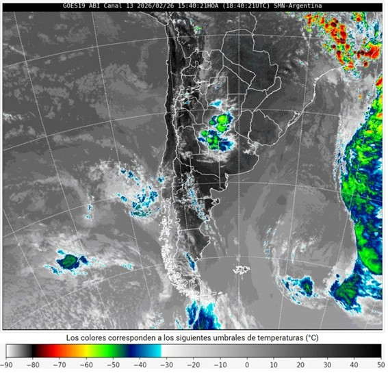
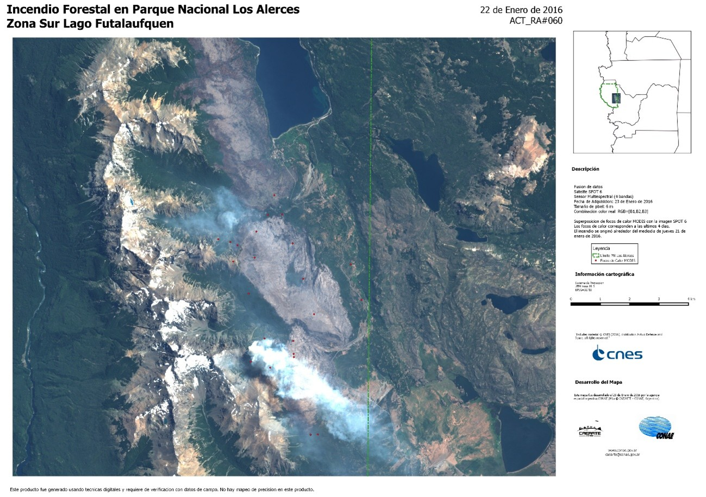
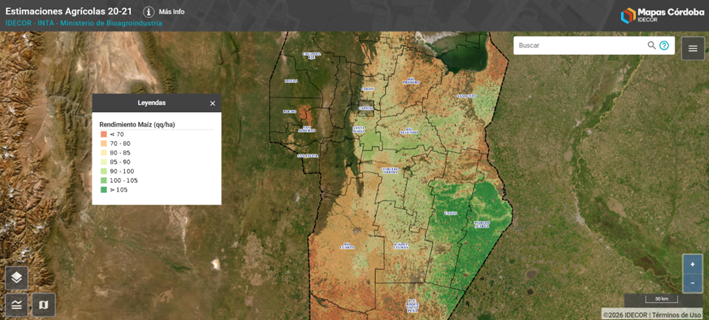
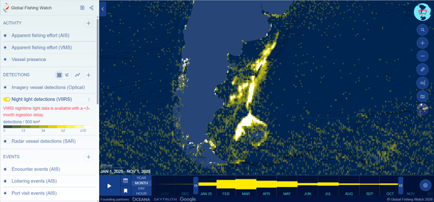

# Week - Grasping the Basic of Remote Sensing

<br>

**Data** is expanding everywhere, or, at least, that's what tech gurus say. However, anyone who has spent some time exploring open data portals knows how difficult it is to find high-quality datasets that remain consistent, continuous, and comparable over long periods of time.

What if I told you there is an (almost) free endless source of information about the Earth?

**Remote Sensing (or Earth observation)** is the **process of acquiring information about something from a distance.**

Each material on the Earth’s surface absorbs, emits, and reflects **electromagnetic radiation (energy)** in a unique way, creating a distinctive **spectral signature**. This signature travels through space in forms of **electromagnetic waves (EMW)**, which can be detected and measured by **sensors**.

The broad electromagnetic spectrum ranges from long wavelengths, like radio waves, to short ones, like Gamma Ray or X-Ray (our eyes can only perceive just a small fraction of the spectrum!). **Wavelength** is key because it **determines a. how waves scatter or reflect, b. how deeply they penetrate materials, and c. what type of information can be retrieved by passive sensors** (those that detect energy that is naturally available on the Earth's surface. I. e: optical satellites) and/or **active sensors** (those that emit their own electromagnetic signal and measure the energy that is reflected back. I. e. radar systems).

However, the process of sensing is not straightforward as it seems. **EMW interact with many environmental factors** that affect how data is collected. For example, shadows, surface roughness, fluorescence, angles, illumination, etc. can significantly influence the outcomes.

In addition, **as EMW travels through the atmosphere, gases such as vapour, carbon dioxide and ozone absorb and/or scatter specific wavelengths** (specially shorter wavelengths). This process, known as **atmospheric transmission**, determines how much radiation reaches the sensor.

Finally, **Earth observation data is primarily stored in raster formats**, which consist of grid cells (**pixels**) that contain measured values. These **datasets vary according to** a. **spatial resolution** (the size of each pixel), b. **spectral resolution** (the number and width of recorded bands), c. **temporal resolution** (the frequency of sensor revisits), and d. **radiometric resolution** (the sensor’s sensitivity to differences in reflected energy). **Data products also vary depending on the satellites orbital configuration**, such as geostationary (the sensor remains fixed relative to the Earth's surface), geosynchronous (the orbit matches the Earth's rotation), and sun-synchronous (the satellite passes over the same location at approximately the same local time each day).

<br>

## Applications

Remote sensing data and tools are continuously expanding, along with their applications. As mentioned earlier, the various combinations of sensor characteristics, resolutions, and satellite configurations enable researchers to address diverse analytical questions and support decision-making in areas ranging from environmental monitoring to urban planning.

One of the most common and long-standing uses of remote sensing is **weather forecasting**. Weather satellites are equipped with numerous sensors that measure atmospheric variables such as temperature and humidity, but also detect cloud cover, estimate wind speed and direction, and monitor weather events. For example, the [National Meteorological Service (SMN) of Argentina](https://ws2.smn.gob.ar/) has developed an experimental daily rainfall monitoring tool called **SQPE-OBS (Satellite Quantitative Precipitation Estimation with Observations)**. This system combines satellite precipitation estimates from NASA’s IMERG dataset with ground-based weather stations observations to produce more accurate estimates of accumulated precipitation across the southern cone.

```{r fig.align='center', echo=FALSE, out.width="75%", fig.cap="Source: SMN"}

```

In the last decades, remote sensing tools have gained increasing importance as a source of up-to-date, large-scale, and high-quality data for risk management teams. In this context, satellite imagery is widely used for **early warning, monitoring, and tracking environmental hazards**, such as floods, droughts, heat waves, wildfires, and other extreme weather events, supporting emergency response and long-term resilience planning.

One example of these initiatives is [Geofuego](https://manejodelfuego.conae.gov.ar/), a comprehensive platform for monitoring forest, rural, and wildland fires in Argentina, developed by the [Centro de Investigación y Extensión Forestal Andino Patagónico (CIEFAP)](https://www.argentina.gob.ar/ciencia/sact/cites/ciefap) in collaboration with the [Comisión Nacional de Actividades Espaciales (CONAE)](https://www.argentina.gob.ar/ciencia/conae), Argentina's National Meteorological Service (SMN), and the Ministry of Security of Argentina.

```{r fig.align='center', echo=FALSE, fig.cap="Source: CONAE"}

```

Remote sensing imagery can also support **economic development**. For example, it can be used for monitoring agricultural productivity, identifying geological formations with mining potential, tracking urban expansion for real estate development, and selecting optimal locations for wind farms or solar energy facilities, among many other applications. If you want to learn more about these examples, you can have a look to the [geoportal](https://www.idecor.gob.ar/mapas-cordoba/) of the [Infraestructura de Datos Espaciales de la Provincia de Córdoba (IDECOR)](https://www.idecor.gob.ar/).

```{r fig.align='center', echo=FALSE, out.width="85%", fig.cap="Source: IDECOR"}

```

Finally, as economic activities expand, remote sensing can also serve as a valuable tool for **public administration**, including **tax monitoring and the detection of (illegal) activities**. In this sense, satellite sensors can observe areas that are otherwise difficult or costly to monitor through traditional methods, such as the open ocean. For example, the platform [Global Fishing Watch](https://globalfishingwatch.org/) uses night-time light imagery to detect and track illegal fishing activity in international waters.

```{r fig.align='center', echo=FALSE, out.width="85%", fig.cap="Source: Global Fishing Watch"}

```

<br>

## Final Thoughts

Earth Observation is worth trying. The growing availability of satellite products, combined with increasingly high-quality and up-to-date data, makes remote sensing a valuable resource for decision-making. The possibilities are vast. It can provide insights that support evidence-based policies at both national and subnational levels. At the urban scale, this is particularly relevant, as it opens new opportunities for local governments to manage cities more effectively, for example, by measuring urban expansion, monitoring land-use changes, detecting illegal dumping, or analyzing traffic patterns.

However, (and we must be sincere) remote sensing is not a bed of roses. Earth observation requires specialized technical skills and knowledge that are not always easy to acquire. This expertise remains relatively scarce, particularly in developing countries where data gaps are often greater and where many of the environmental and urban challenges that will shape the future of the planet are unfolding.

In addition, although the cost of satellite data and processing tools has been decreasing, not all countries have the technological capacity or financial resources to develop and operate their own satellite infrastructure. Many therefore depend on data provided by international space agencies or external institutions.

This raises another important challenge: the long-term openness of Earth observation data. Today, several international and governmental agencies, such as NASA, Copernicus, or CONAE, open large volumes of satellite imagery for free. Will it be the same in the future? As demand for raster data continues to grow due to its analytical and economic value, satellite imagery may become an increasingly strategic resource. This could raise concerns related to data governance, security, and access. If these datasets were to become restricted or commercialized, many researchers, institutions, and governments (particularly in developing regions) could face new barriers to accessing critical spatial information.

Let’s be optimistic! Despite these challenges, remote sensing represents a major opportunity today, particularly for filling persistent data gaps and supporting more informed spatial decision-making.
