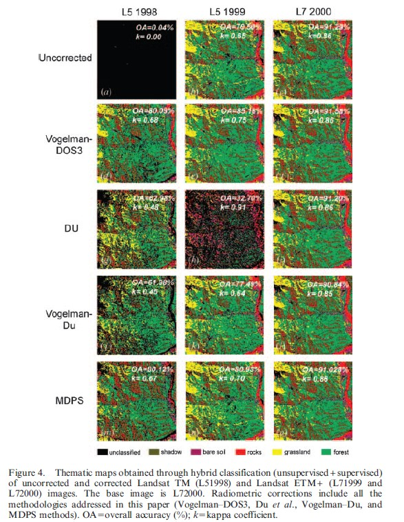
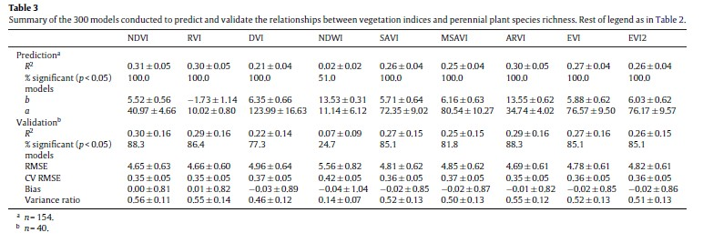

# Week - No one is perfect: Imagery Calibration and Enhancement

<br>

One of the most fascinating things with remote sensing is that you can create multiple **subproducts** from the same dataset. However, we have to bear something important in mind: **raw satellite imagery rarely represents the Earth’s surface accurately** because distortions may arise from **sensor limitations, atmospheric conditions or terrain effects**. For that reason, how we account errors and flaws and how we interpret the results are key parts of the remote sensing process.

We have **four ways in which we can calibrate our imagery**:

-   **Geometric correction** aligns images with real-world coordinates by using ground control points and geometric transformations to correct **distortions in shape, position, size, or orientation of features** caused by sensor angle, platform movement or Earth curvature. These types of corrections are particularly useful when working with urban planning and infrastructure monitoring.

-   **Orthorectification** incorporates elevation data to correct **topographic distortions** and ensures that each pixel corresponds to its **true geographic location** in terms of height, angle, and elevation while displayed in 90° windows (nadir view). This is key when working with complex terrains, like mountains.

-   **Radiometric correction** addresses **variations in sensor response and illumination conditions**. Originally, sensors store measurements as **Digital Numbers** (the intensity of electromagnetic radiation per pixel). What radiometric calibration does is to convert them into **spectral radiance** (or the amount of light within a band from the center in the field of view) which is a more useful unit for analysis, and ultimately, turn them into **reflectance values**, which are standardizes and allows comparisons. Radiometric correction may be very useful for long-term vegetation change, desertification, glacier melting, etc.

-   **Atmospheric correction** removes the **effects of scattering and absorption caused by the atmosphere**. These corrections can be relative to a pixel (like **Dark Object Subtraction**) or to a consistent feature (like **Pseudo-Invariant Features**), or absolute through atmospheric models (like **FLAASH**) or through ground-based measurements (like **Empirical Line Calibration**). Probably, you may have a look at them while working with imagery of cloudy cities, such as Puerto Argentino.

Apart from corrections, **satellite images can be enhanced through aesthetic manipulation to improve visual interpretation and highlight specific features without modifying pixel values**. Common techniques include **contrast enhancement** to increase feature visibility, **band ratios** to emphasize spectral differences, **spatial filtering** to smooth or sharpen details, **principal component analysis** to reduce redundancy, **texture analysis** to detect spatial patterns, and **data fusion** to integrate complementary datasets.

<br>

## Applications

Imagery correction and enhancement are fundamental and widely applied procedures in remote sensing. Omitting these processes can produce significantly biased results, as demonstrated by [Paoli et al. (2006)](https://www.tandfonline.com/doi/full/10.1080/01431160500183057) in their study “*Radiometric correction effects in Landsat multidate/multi-sensor change detection studies*”. In this work, the authors compare absolute and relative correction methods using multiple Landsat TM and ETM+ images of the Argentinian northwestern jungles, the \*Yungas\*\*. Their results show that using uncorrected imagery for environmental change detection may produce unrealistic change estimates, reaching values two to three times higher than those obtained from corrected images. In this fashion, the authors conclude that radiometric and atmospheric corrections are essential for reliable multi-sensor change detection and for ensuring consistent data comparison across time.

```{r fig.align='center', echo=FALSE}

```

For reasons like the stated above, many satellite imagery datasets are now distributed as preprocessed collections with standardized processing levels, which facilitate large-scale analysis and ensure greater data consistency. In this context, **satellite imagery is commonly organized into "collections"**, which group images according to their processing standards. These collections are further divided into “**levels**” that represent specific data products, while levels may also be classified into “**tiers**” that indicate different data quality and processing reliability. As a result, we can access a wide variety of satellite imagery products tailored to different analytical needs and research objectives (so good!).

However (oh no!), as the number and diversity of remote sensing products increases, selecting the most appropriate datasets, corrections, and analytical methods becomes increasingly important. For example, in the study “*Evaluating the performance of multiple remote sensing indices to predict the spatial variability of ecosystem structure and functioning in Patagonian steppes*”, [Gaitán et al. (2013)](https://www.sciencedirect.com/science/article/pii/S1470160X13002033?casa_token=ths_c3JZGd0AAAAA:VJm5SXOayia8wchqOwVsmYew9TtBYq-YLRgTse0wLzQXj5LyOpOKJXGMl8LmgrFJ6ULmUVMKmJc) investigate the use of satellite-based vegetation indices to monitor the health and structure of dryland ecosystems in southern Argentina. The researchers compared nine (yes, nine!) different vegetation indices derived from MODIS data against ground-level measurements of plant diversity, vegetation cover, and soil functionality. These indexes are not other than different variations of band ratios designed to emphasize specific spectral characteristics of ground features. The results indicate that the Normalized Difference Vegetation Index (NDVI) was the most effective tool for predicting spatial variability in vegetation and nutrient cycling. Nevertheless, each index may therefore be suitable for other particular research questions or environmental conditions.

```{r fig.align='center', echo=FALSE}

```

Together, these studies show that **remote sensing applications depend not only on data availability but also on careful selection of corrections, indices, and methods**, ensuring that satellite imagery produces reliable, meaningful insights for environmental monitoring and analysis.

<br>

## Final Thoughts

Remote sensing offers an endless range of possibilities. The combination of different data formats, spatial and temporal resolutions, processing scales, corrections, and enhancements applied to satellite imagery allows users to generate highly specialized products capable of addressing very specific questions.

However, achieving these results is far more complex than it sounds. The ability to create multiple products from the same dataset implies that numerous processing steps and methodological decisions must be carefully considered, as well as the technical complexity of the techniques involved. For instance, the order in which image corrections are applied is not arbitrary. Applying a topographic correction before or after an atmospheric correction can produce substantially different results, highlighting the importance of methodological rigour in remote sensing workflows. Ultimately, what truly matters is not the ability to generate an infinite number of remote sensing products, but rather the capacity to accurately interpret remotely sensed data and to compare it consistently across time and space.

But don't thrill yourself! **My recommendation: Stick to the classics and grasp the basics of linear regression**. Many of the calibrations and enhancements we have just seen rely on the application of linear regression models, where coefficients represent the rate of change between the real values and the expected ones.

Finally, it is important to recognize that advanced image enhancement and calibration techniques can be computationally demanding, particularly when applied to large spatial datasets. However, recent technological developments provide strong reasons to be optimistic. In recent years, powerful platforms such as [Google Earth Engine](https://earthengine.google.com/) have enabled analysis of massive volumes of satellite imagery, expanding the scale at which remote sensing studies can be conducted.

What does the future hold for us? As computational power, data availability, and spatial resolution continue to improve, the potential applications of remote sensing are likely to expand even further. Could the day come when we are able to analyze the world’s soils at planetary scale, using spatial indices to identify the specific parcels of land capable of maximizing food production? Might such advances bring us closer (at least, theoretically) to overcoming global hunger? It may sound ambitious, perhaps even idealistic, but the rapid evolution of remote sensing technologies suggests that these possibilities are no longer purely imaginary. *You may say I’m a dreamer, but I’m not the only one...*
