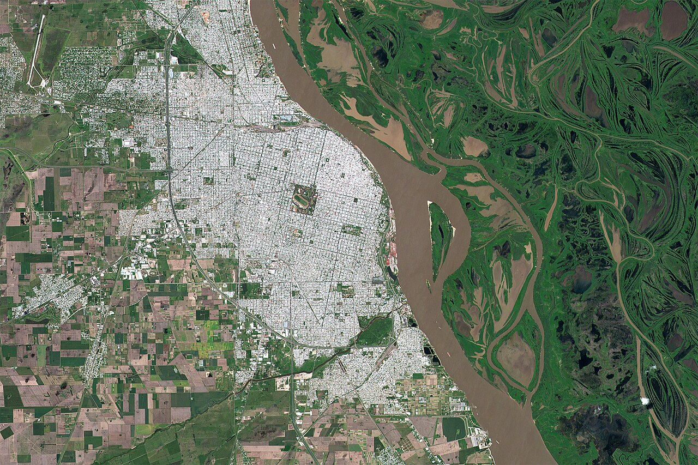
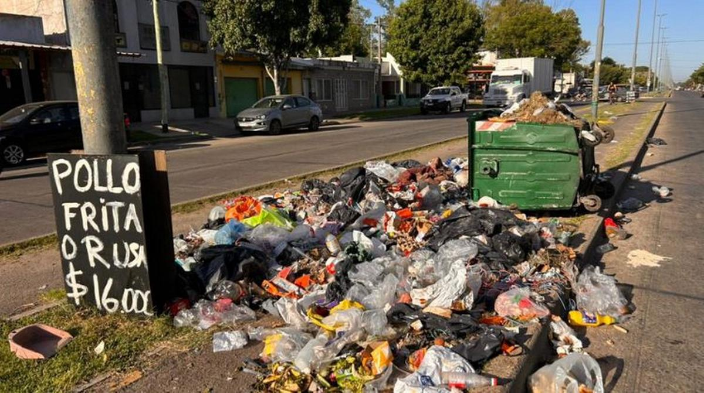
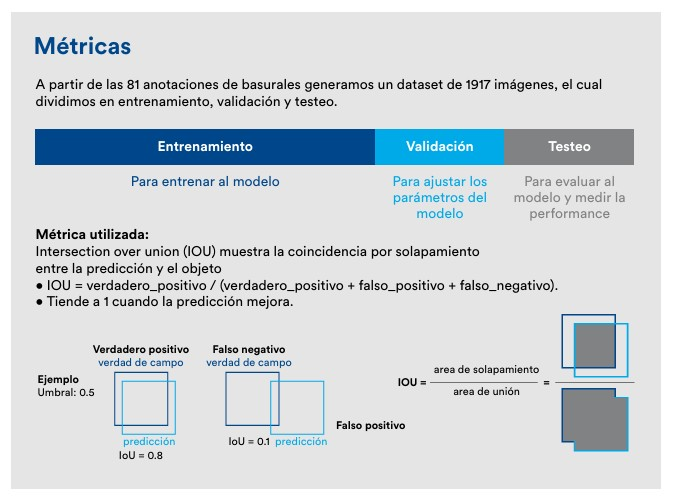
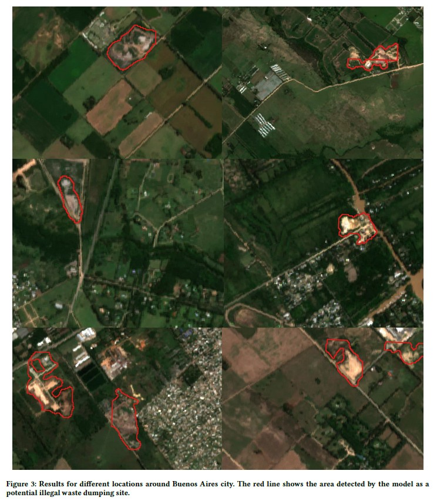

# Week - How can we take advantage of Remote Sensing (without dying in the attempt)?

<br>

[Greater Rosario](https://www.google.com/maps/place/Rosario,+Santa+Fe,+Argentina/@-32.9520382,-60.7783419,22264m/data=!3m2!1e3!4b1!4m6!3m5!1s0x95b6539335d7d75b:0xec4086e90258a557!8m2!3d-32.9587022!4d-60.6930416!16zL20vMDJ0YjE3?entry=ttu&g_ep=EgoyMDI2MDMyMy4xIKXMDSoASAFQAw%3D%3D) is the third-largest metropolitan area in Argentina, after Buenos Aires and Córdoba, with a population of approximately 1.5 million people according to the most recent [national census (2022)](https://www.indec.gob.ar/indec/web/Nivel4-Tema-2-41-165). It is also one of the country's main economic centers and home to one of the world’s most important agricultural export ports.

```{r fig.align='center', echo=FALSE}

```

Since 2010, 32 municipalities and communes in the region have joined to form the the [Ente de Coordinación Metropolitana de Rosario (ECOM)](https://ecomrosario.gob.ar/), a voluntary association of local governments dedicated to metropolitan planning, coordination, and the promotion of public policies.

One of the main responsibilities of ECOM is the development of the [Metropolitan Solid Waste Management Plan](https://ecomrosario.gob.ar/proyect/6), which aligns with the directives of [Santa Fe Province law n° 13.055 “Zero Waste”](https://www.santafe.gov.ar/normativa/item.php?id=109524&cod=d188ecfdc85bee2cfbede037271cb72f) aimed at promoting the progressive reduction of solid waste across the district. Among its central objectives is the **eradication of open-air dumps**, a persistent environmental challenge in the metropolitan area.

Open dumps are **sites where solid waste is disposed of indiscriminately, without operational control or adequate environmental safeguards**, reflecting significant deficiencies in municipal waste management systems. As a result, these sites **pose serious health and environmental risks**, particularly for vulnerable communities, as they contaminate soil, groundwater, and air. They can also disrupt plant life cycles, foster the proliferation of pests and disease vectors, release toxic substances and pollutants into the air, and increase greenhouse gas emissions.

```{r fig.align='center', echo=FALSE}

```

Currently, there are **at least 400 open dumps across Santa Fe Province**, according to the [Argentinian Chamber of Industrial and Special Waste Transporters](https://www.ambito.com/sustentabilidad/santa-fe-frente-la-crisis-los-basurales-400-focos-activos-y-un-desafio-que-no-espera-n6223539). However, how many are there in the Greater Rosario? Where are they? The exact number and spatial distribution of these sites in Greater Rosario remain uncertain. Access to complete and up-to-date information on this issue continues to be a challenge, potentially affecting effective decision-making.

At present, **there is no comprehensive primary source of information on the location of open dumps in the metropolitan area**. Instead, the diagnosis presented in the Metropolitan Solid Waste Plan relies mainly on data collected through a survey distributed to technical and political staff from the municipalities and communes that make up ECOM.

In this context, remote sensing technologies offer valuable opportunities to address existing information gaps and support the monitoring and improvement of the public policy.

<br>

## How can we improve our policy?

In recent decades, **satellite and aerial imagery have been widely used in cities around the world (and even in Argentina) for territorial monitoring and landfill detection**. This type of data has proven extremely valuable, particularly when combined with recent advances in machine learning and artificial intelligence.

One relevant example is an [open-source tool](https://fractalargentina.org/herramienta/detector-de-basurales-a-cielo-abierto/) developed by the [Bunge and Born Foundation](https://fractalargentina.org/) and implemented in the city of Mendoza (Argentina) **to detect open-air and small-scale dumping sites using remote sensing imagery**.

The landfill detector is based on a **convolutional neural network that analyses aerial imagery to identify waste at the pixel level**. Unlike large open-air dumping sites, which can often be detected using freely available satellite imagery, micro landfills occupy relatively small areas and therefore require high-resolution aerial images, such as those captured by drone flights.

```{r fig.align='center', echo=FALSE}

```

For this reason, the detector primarily uses data from [OpenAerialMap](https://openaerialmap.org/), an online service that allows users to search for and download freely available aerial imagery collected by drones and aircraft, with a (super high) spatial resolution of at least 3 cm by pixel (!!!). However, the model can also be adapted to satellite imagery. For example, a previous model developed by Maria Roberta [Devesa and Antonio Vazquez Brust (2021)](talargentina.org/wp-content/uploads/2025/10/Mapping-illegal-waste-dumping-sites-with-neural-network-classification-of-satellite-imagery-2021.pdf) was used to identify open-air landfills in the Province of Buenos Aires using six-band images from Sentinel-2: three visible color bands (RGB), a near-infrared (NIR) band, a shortwave infrared (SWIR-1) band, and the normalized difference between the two SWIR bands.

```{r fig.align='center', echo=FALSE}

```

The model was trained and validated using Python’s package [Rastervision](https://docs.rastervision.io/en/latest/index.html), an open-source library and framework for deep learning on satellite and aerial imagery. Overall, it can detect open-air, micro-level landfills **with 90% accuracy**, including those sites that are often overlooked by conventional surveys or administrative records. These approaches demonstrate how remote sensing and machine learning can support the identification and monitoring of illegal dumping sites at different spatial scales.

<br>

## Final Thoughts

The use of aerial and satellite imagery for detecting and monitoring open dumps represents a significant opportunity to make informed decisions that enable our cities to advance toward achieving [Sustainable Development Goals](https://sdgs.un.org/goals) *11 - Sustainable Cities and Communities*, *12 – Responsible Consumption and Production*, and *14 – Life Below Water*.

In the case of Greater Rosario, this tool could substantially improve the planning process of the Metropolitan Solid Waste Management Plan simply by providing two fundamental pieces of information: Where are the landfills? How many are them? This would promote a more efficient and controlled waste management system, fostering the emergence of a liveable and sustainable habitat for all.

Additionally, the high accuracy of aerial imagery allows for the effective identification of the main concentrations of micro-landfills and, potentially, the establishment of a monitoring strategy capable of responding quickly and efficiently, given their informal and sporadic nature.

Regarding this last point, it is important to note that the precision and speed of the response will depend on the availability of aerial imagery. Despite its importance, accessing such resources and their collection methods for free can often be challenging, particularly when up-to-date data is required. For this reason, frequently, municipalities are forced to hire private services to obtain these types of images, which can be costly for their budgets.

Nevertheless, there are reasons to be optimistic. The costs of acquiring aerial imagery are steadily decreasing with the emergence of increasingly affordable drones, while the quality of their sensors continues to improve.
