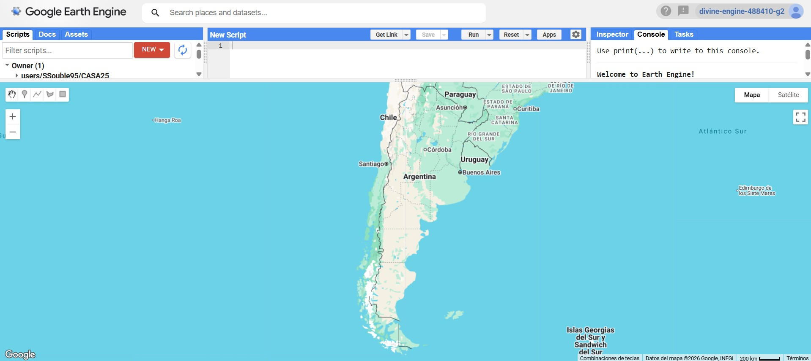
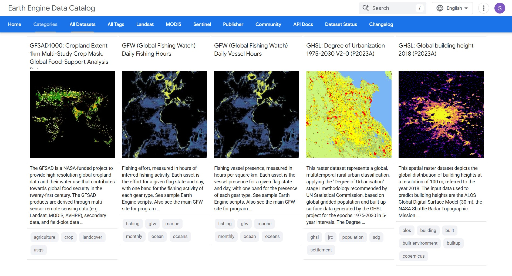
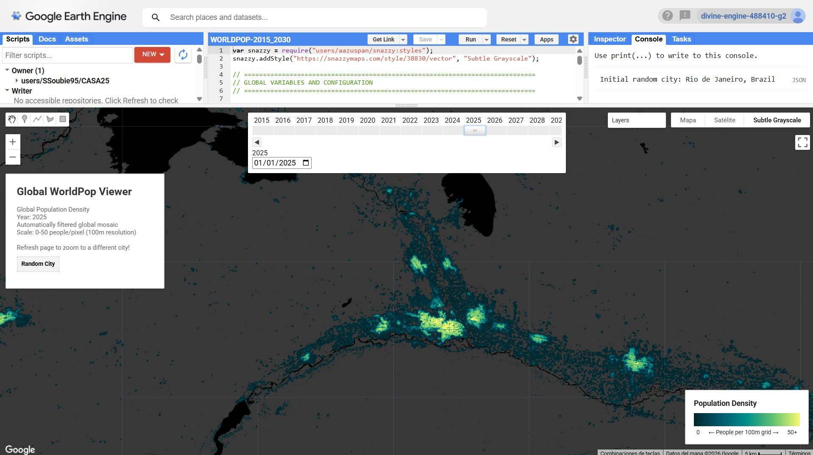
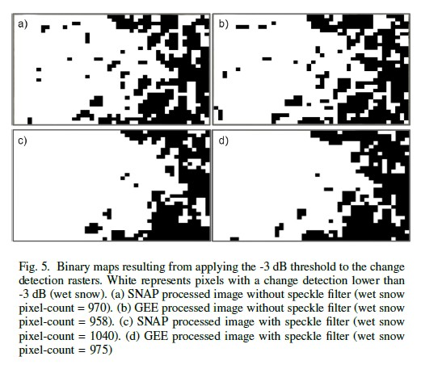
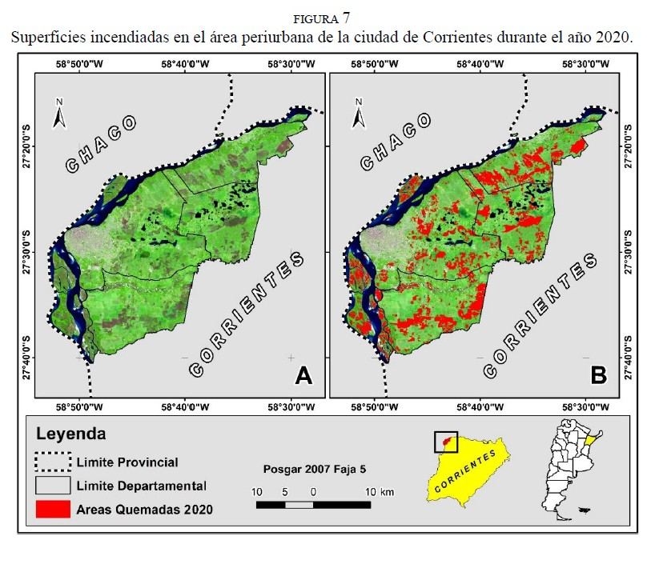

# Week - GEE: Google Earth Engine or Gorgeous Ephemeral Experience?

<br>

[Google Earth Engine (GEE)](https://earthengine.google.com/) has become one of the most popular platforms for geospatial analysis these days. It is a powerful and freely accessible **cloud-based geospatial processing system** that integrates a yuge catalogue of Earth observation data, high-performance cloud computing infrastructure, and programming capabilities through JavaScript and Python. Let’s dive into deep:

```{r fig.align='center', echo=FALSE, out.width="85%", fig.cap="Source: GEE"}

```

To begin with, a **key component of GEE is its massive public data [catalogue](https://developers.google.com/earth-engine/datasets/catalog)**, which includes a wide range of Earth observation datasets from a variety of widely used satellite imaging systems (like Landsat or Sentinel) across all sorts of spectral wavelengths, but also environmental, climatic, topographic and socio-economic datasets, like night-time lights, floods records, daily temperatures, etc. These **datasets are preloaded and preprocessed within the platform, allowing users to easily access and analyse large volumes of geospatial information without the need for local storage or complex data management**.

```{r fig.align='center', echo=FALSE, out.width="85%", fig.cap="Source: GEE"}

```

Another key point of the platform is that its analytical capabilities **rely on parallel processing and lazy computation models, which reduce processing times drastically**. In this context, **users can smoothly perform a wide range of spatial operations**, including filtering, subsetting, joins, clipping, zonal statistics, and image classification, taking advantage of its API and web-based interactive development environment. In addition, advanced analytical techniques, such as **machine learning, deep learning, supervised and unsupervised classification, can be applied** to study spatial patterns at different scales.

```{r fig.align='center', echo=FALSE, out.width="85%", fig.cap="Source: GEE"}

```

Despite its many advantages, we should reckon that GEE also presents some **limitations**. First, as it is provided by a private company, there are **processing quotas, restrictions on system usage, and other limitations that have become more common as the platform has become popular**. These constraints raise concerns about unrestricted access to the platform in the future.

Additionally, the **requirement to adapt existing algorithms to the GEE API** may represent a challenge for some users. Also, operations that involve intensive iterative computation or rely on large datasets not already available within the platform can also present additional technical difficulties.

<br>

## Applications

Google Earth Engine is winning a place between the most popular tools in remote sensing due to its key features (easy access to heavy geospatial datasets, high computational power, integration with other platforms and apps, etc.), supporting a wide range of applications including forest monitoring, crop yield estimation, flood mapping, climate analysis, etc.

In this context, several studies have highlighted the strength of GEE in comparison with other well-established tools in the field. One example is “*Wet snow detection in Patagonian Andes with Sentinel-1 SAR temporal series analysis in GEE*” by [Beltramone et al (2020)](https://ieeexplore.ieee.org/document/9505487). In this article, the authors explore the application of Sentinel-1 SAR satellite imagery within the GEE platform for monitoring wet snow conditions in the Argentinian Andes by comparing it with more labor-intensive manual approaches (such as [The Sentinel Application Platform - SNAP](https://earth.esa.int/eogateway/tools/snap)). In overall, the findings indicate that **GEE provides a cost-efficient and effective alternative to hazardous field observations and SNAP for supporting water resource management and improving natural hazard prediction**. Such findings are particular important because time is key when dealing with crisis.

```{r fig.align='center', echo=FALSE, out.width="75%", fig.cap="Source: Beltramone et al (2020)"}

```

In some cases, the improvements in precision and efficiency provided by GEE can lead to highly valuable outcomes for decision-making. In 2021, [Smichowski et al.](https://ri.conicet.gov.ar/handle/11336/183116), in their work “*Evaluación de incendios en áreas periurbanas de la ciudad de Corrientes (Argentina) durante la sequía extrema del año 2020*”, examined the consequences of large-scale wildfires that affected peri-urban areas of Corrientes, Argentina, during the drought of 2020 by combining Sentinel-2A satellite imagery with GEE. By identifying an optimal detection threshold, the **analysis revealed that more than 21% of the land vulnerable to fire was affected, a figure considerably higher than official government estimates**. In addition, the authors developed a **Fire Density Index** to better quantify fire magnitude by taking advantage of GEE’s capabilities. In my opinion, the study highlights the virtues of GEE (over the traditional tools) for generating accurate spatial information to support effective decition-making, specially within the fields of fire risk management and ecosystem restoration

```{r fig.align='center', echo=FALSE, out.width="75%", fig.cap="Source: Smichowski et al (2021)"}

```

<br>

## Final Thoughts

Google Earth Engine is the Ferrari of Earth observation tools. It is big (with enormous storage capacity), fast (an extremely powerful computational engine), elegant (it allows the creation of attractive visualizations), and ultimately an impressive piece of engineering (behind its relatively simple interface lies an extremely complex system that most users ignore).

There is no doubt that, as cloud computing and artificial intelligence continue to evolve, the platform will play an increasingly important role in global environmental monitoring and geospatial analysis. For instance, Could we monitor how cities grow in almost real time? Could we predict school abandonment using roof materials? Could local governments tax properties on the volume of their swimming pools?

Now, I want to ask you something: How long can a Ferrari remain freely available to everyone? Owning a Ferrari at the beginning of the last century would have made little sense without the infrastructure needed to sustain it (roads, fuel, and maintenance systems). The automobile shaped the city and the city shaped the car. Similarly, GEE relies on massive infrastructure and resources. As its capabilities expand and its applications become increasingly valuable, maintaining unrestricted access may become more challenging.

The economic and practical applications of GEE continue to grow. The platform is becoming easier to integrate into other tools and services, its user [community](https://gee-community-catalog.org/) expands every day, and Mr. Google continues to invest enormous computational resources and expertise into its development. I bet you that, while you read this, it is taking place a high important meeting at Silicon Valley where a sharp dressed man is asking “Who is paying the bill for all of this?”

Business as usual. As my grandmother wisely says "*we should never take things for granted*". GEE gives us an unprecedented power, and with great power comes great responsibility too. So, use it wisely! Run fast to create new geospatial solutions for the most thrilling challenges of this world before it's too late!
