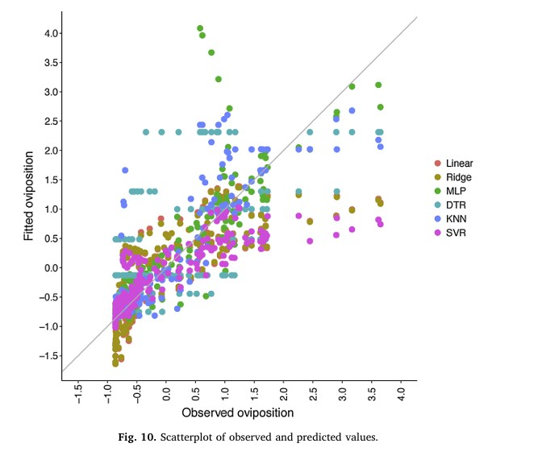
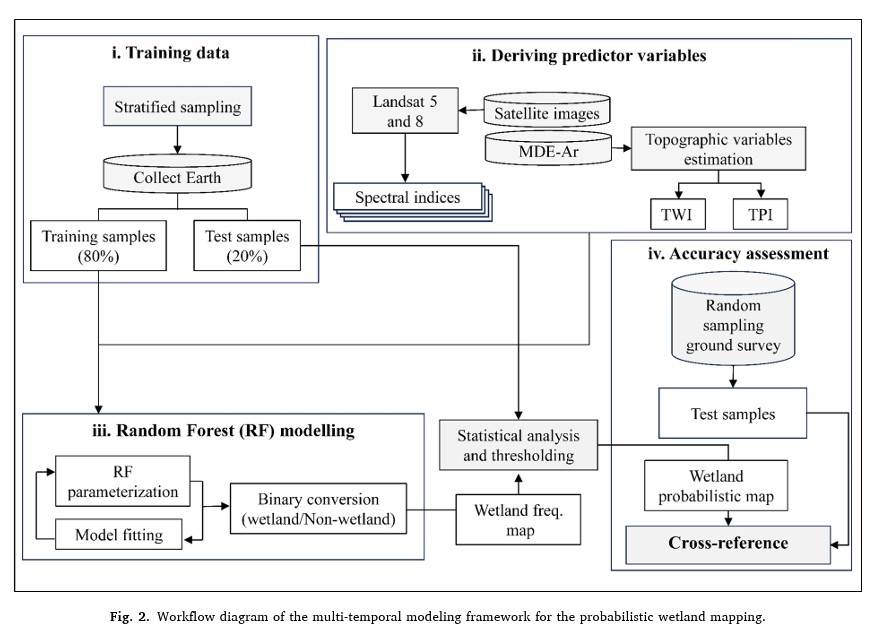

# Week - Can we apply machine learning to remote sensing?  [YES] | no

<br>

I bet you 50 pounds that you have heard the concept **machine learning** at least 10 times during the last week. Everyone is speaking about it nowadays! However, what is machine learning exactly? Well, it is **the cornerstone of artificial intelligence**. It is **the science that enables computers to learn from data and make predictions without being programmed**.

**Machine learning methods can be grouped into supervised and unsupervised approaches. Supervised learning uses labelled data to train a model to classify or predict new data or outcomes. In contrast, unsupervised learning works with unlabelled data and aims to identify patterns or group similar data without predefined answers**.

Broadly speaking, **a typical machine learning workflow involves splitting data into training and testing subsets** (commonly using a 70/30 partition, like the [fernet](https://en.wikipedia.org/wiki/Fernet_con_coca)). **Then, the model is trained** (using labelled samples in supervised learning or identifying patterns in unsupervised approaches) and then **applied to new data to generate predictions**. Finally, **validation methods are used to assess the model’s performance and ensure that the results are reliable and generalizable**.

The most common machine learning methods are **Classification and Regression Trees (CART)**, which iteratively partition data by minimizing impurity or prediction error, and **Random Forests**, which combine multiple decision trees using bootstrap resampling and out-of-bag validation, which improves accuracy and reduces overfitting.

In respect to Earth observation science, its integration with machine learning techniques has grown substantially, with applications in urban expansion, environmental monitoring, and object detection, just to mention a few. Nowadays, supervised methods are more widely used than unsupervised ones, particularly non-parametric approaches. For example, **Support Vector Machines**, a supervised model widely applied to analyze raster data, maximize the separation between classes of pixels by defining optimal hyperplanes, while allowing for some controlled misclassification.

However, **machine learning methods are neither magic nor perfect**. **Their performance depends heavily on the quality and representativeness of the input data**. Incomplete or low-quality data can lead to inaccurate or biased outcomes. In addition, **model performance is highly sensitive to parameter selection**, and poorly tuned models may suffer from overfitting or inaccuracy, reducing their ability to generalize new data.

<br>

## Applications

The developments in machine learning techniques and powerful hardware have brought new opportunities to Earth observation research and applications. Today, these models can integrate large volumes of heterogeneous data and capture complex, non-linear relationships that traditional statistical approaches often fail to represent.

One important application of the integration between remote sensing and machine learning is the **prediction of spatial dynamics**. One example that I’ve found really interesting is the **forecasting of vector-borne disease expansion**. In the study “*Modeling Dengue vector population using remotely sensed data and machine learning*”, [Scavuzzo et al. (2018)](https://www.sciencedirect.com/science/article/pii/S0001706X17312111) model the population dynamics of mosquitoes, the primary vector of Dengue, Zika, and Chikungunya, in Tartagal, Argentina. By comparing traditional linear models with machine learning algorithms, such as **K-Nearest Neighbors, Multilayer Perceptron, and Support Vector Machines**, the study shows that non-linear approaches provide more accurate predictions on mosquito activity. In my point of view, this article highlights the ability of machine learning to better capture the complex interactions between complex phenomena, such as the relationship between environmental and epidemiological variables.

```{r fig.align='center', echo=FALSE, out.width="75%", fig.cap="Source: Scavuzzo et al. (2018)"}

```

Machine learning and remote sensing have also been successfully applied to **environmental monitoring**. In “*Probabilistic Wetland Mapping in Argentina Using Remote Sensing*”, Navarro [Rau et al. (2025)](https://www.sciencedirect.com/science/article/pii/S2589471425000130) identify and monitor wetlands across Argentina using a supervised Random Forest model. They built a model to detect wetlands based on water presence, specific vegetation, and favourable geomorphological conditions, achieving an accuracy of approximately 90%. Also, this study maps the “elasticity” zones, which represent how wetlands expand or contract in response to climatic cycles such as El Niño.

```{r fig.align='center', echo=FALSE, out.width="75%", fig.cap="Source: Rau et al. (2025)"}

```

<br>

## Final Thoughts

Machine learning and remote sensing have proven to be a powerful couple. However, the effectiveness of these tools depends heavily on the quality and representativeness of the data, which are often difficult to ensure. Additionally, high-resolution data does not necessarily guarantee improved outcomes, particularly when classification uncertainty or mixed pixels are present.

However, the quality, extent, completeness, consistency, and temporal resolution of satellite data are often superior to those of vector and alphanumeric datasets. In this sense, satellite imagery enables the development of more robust machine learning models compared to the vector or alphanumeric data that is typically available.

The availability of data is another key advantage of using satellite imagery to train machine learning models. On one hand, there are various open-access platforms that provide imagery under permissive usage licenses. On the other hand, satellite data covers areas that are difficult to access or where no ground measurements or records exist, increasing the spatial coverage and applicability of the models.

This situation leads to another really important discussion: the trade-off between model complexity and interpretability in machine learning. Highly complex and precise models can turn into true “black boxes,” making it very difficult to understand and justify the decision-making process. In the same way, overly simple models may excessively simplify reality, failing to capture important patterns and relationships.

In the end, the choice of methods should be guided by the specific needs of the data and its intended application, as different techniques offer varying levels of interpretability and accuracy. Accuracy is important, but it is not the only thing. It is not only about improving predictive performance, but also about ensuring that the outputs are transparent, reliable, and meaningful. My suggestion: *Lo bueno y simple es dos veces bueno* (or, in Shakespeare’s words: ***Brevity is the soul of wit***). **Not over-complicate things!**
