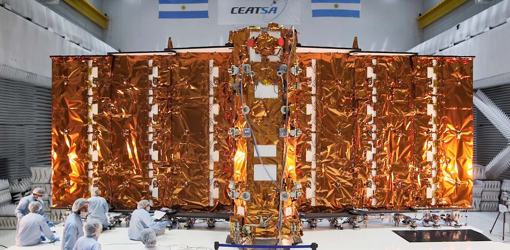
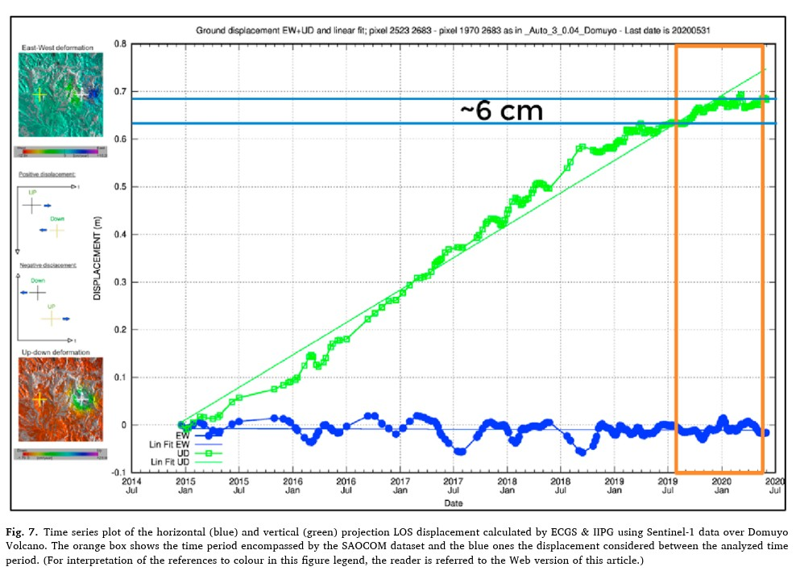
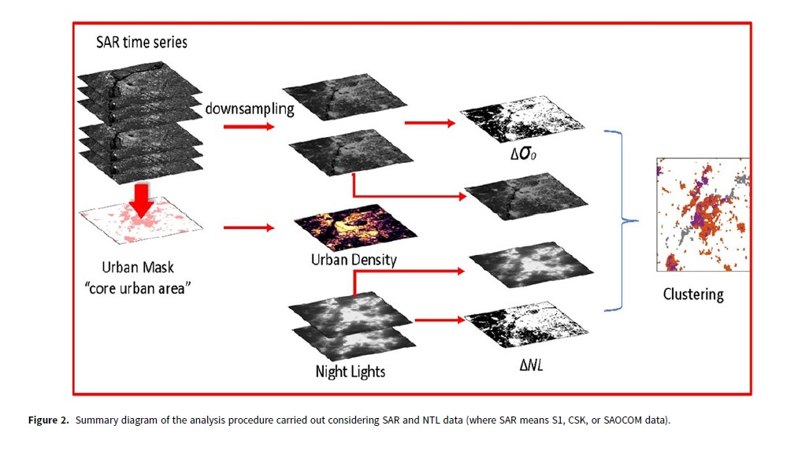

# Week - This is the end, but don’t be SAR: Synthetic Aperture Radar

<br>

The **Synthetic Aperture Radar (SAR)** is an **active sensor** which scans Earth’s surface by **emitting microwave pulses** and processing the backscattered signals. In this process, [SAR](https://www.earthdata.nasa.gov/learn/earth-observation-data-basics/sar) **records both the amplitude** (or the intensity of the returned signal) and the **phase** (or the relative position of the wave cycle when it returns to the sensor).

SAR generates high-resolution imagery because its powerful microwaves **can penetrate vegetation, cloud cover and darkness**, showing information that is often not detectable by passive sensors. This makes SAR satellites particularly useful for monitoring events, as **they can observe the Earth’s surface on almost every condition**.

However, there are some challenges. Earth’s surface is not homogeneous and many factors interact with the signal, scattering the electromagnetic waves in different forms. For this reason, when working with SAR, **it’s essential to consider three factors**:

**Polarization**, which refers to the **orientation of the electromagnetic waves’ oscillations. SAR systems can emit and receive signals in different polarization combinations** (Vertical - VV, Horizontal - HH, Vertical-Horizontal - VH, Horizontal-Vertical - HV) **and different surfaces respond differently** to them. For example:

+ Uneven surfaces, such as bare soil or rough water, tend to produce multi-directional reflections that result in moderate backscatter intensity. This is known as **Rough Surface Scattering** and is particularly sensitive to vertical polarization.

+ Perpendicular surfaces, such as buildings or tree trunks, often generate a very strong backscatter due to the interaction between vertical and horizontal surfaces. This is known as **Double-bounce Scattering** and is sensitive to horizonal polarization.

+ Complex 3D structures, such as forest canopies, crops, or snow, which cause multiple internal reflections, result in a strong backscatter especially in cross-polarized signals (VH or HV). This is known as **Volume scattering**.

**Permittivity**, or **the ability of an element to store and transmit energy**. This determines how reflective an element is (and how much signal goes back to the sensor). For example, water typically has low backscatters, as they reflect most of the signal away.

**Wavelength**. The contribution of different scattering mechanisms varies as a function of wavelength, since it directly affects the penetration depth of the emitted signal.  For example, longer wavelengths go deeper, enhancing volume scattering.

Due to these factors, **different wavelengths are suitable for different applications**. For example, shorter wavelengths, with limited penetration, are commonly used for change detections monitoring, whereas larger wavelengths are used for vegetation analysis.

<br>

## Applications

In 2018, Argentina launched the space mission [SAOCOM (Satélite Argentino de Observación Con Microondas)](https://saocom.invap.com.ar/), which operates two satellites equipped with a L-band SAR sensors. The main function of these satellites is to provide information for agricultural applications, including the development of crop disease risk maps, the generation of early flood warning systems through hydrological modelling, and the support of risk and emergency management activities, such as oil spill detection at sea and flood extent monitoring, among other applications.

```{r fig.align='center', echo=FALSE}

```

However, the SAOCOM mission has also been effectively applied for other uses than the ones that it was meant to. For example, SAR enables [interferometry](https://science.nasa.gov/mission/nisar/interferometry/) techniques, known as **InSAR**. **Based on the phase data recorded, InSAR compares two or more images of the same area retrieved at different times to detect changes in surface elevation.**

We can see one example of this application is the study “*First assessment of the interferometric capabilities of SAOCOM-1A: New results over the Domuyo Volcano, Neuquén Argentina*” by [Roa et al (2021)](https://www.sciencedirect.com/science/article/abs/pii/S0895981120304259) which applies **Differential Interferometric SAR (DInSAR)** to measure volcanic deformation. Over a relatively short eight-month period (August 2019 to May 2020), the authors identified an inflation pattern of approximately 6 cm (yes, 6 cm!) in the volcanic crust. This represents a valuable source of information for monitoring volcanic activity, particularly in a country like Argentina, which has nearly 120 active volcanoes along the Andean volcanic arc shared with Chile.

```{r fig.align='center', echo=FALSE}

```

However, the applications of SAR systems are not limited to rural environments. Indeed, SAR is becoming increasingly important for analyzing the urban phenomena due to its unique characteristics. In the case of SAOCOM, for example, the study “*Joint multitemporal SAR and optical mapping of urban changes*” by [Marzi et al. (2024)](https://www.cambridge.org/core/journals/international-journal-of-microwave-and-wireless-technologies/article/joint-multitemporal-sar-and-optical-mapping-of-urban-changes/54905652729991DD3492194CA9AFD3B8) found that **urban variations can be detected consistently across different microwave frequencies (X, C, and L bands)**. What I've found more interesting is that authors identify specific types of physical changes, such as new construction, demolition, and densification through the development and application of an unsupervised clustering machine learning model. This is spectacular! We can both measure urban expansion and qualify the growth with the same source of information! Pinky, are you pondering what I'm pondering? Potential thesis project: Cross this information with census data.

```{r fig.align='center', echo=FALSE}

```

<br>

## Final Thoughts

I must confess that I have become really obsessed with SAR. It is a powerful technology that provides high-resolution uninterrupted imagery for a wide variety of applications in both natural and urban environments, reinforcing its value as a versatile remote sensing tool.

Obviously, nothing is perfect, and SAR has its challenges as well. Ultimately, the choice of SAR data depends on the specific objective: what we are trying to detect (surface roughness? volume scattering?), what we aim to do (analyze or visualize?), and the characteristics of the area under study (e.g., surface composition and structure).

There is a “world” of opportunities to explore in SAR and Earth observation science out there. However, another confession: I consider that remote sensing still feels somewhat like “magic,” especially in the case of SAR. This is partly due to the relatively high knowledge barriers required to enter the field, which make things almost magical at first sight (and which I consider big challenge to face). It is also because remote sensing belongs to those who master the energy that surround us and know how it behaves, how it is measured, and how it can be analyzed. They see things that other mortals don’t see (especially for those coming from non-technical backgrounds, like political science like me!)

However, one of the positive aspects of AI is that it is lowering these barriers to entry. I strongly believe that we need more sociologists, economists, anthropologists, urban planners, and political scientists involved in Earth observation. The engineering world is essential, but we need also remote sensing to address everyday challenges from interdisciplinary approaches. We don’t just want remote sensing to measure increases in cactus crust in Tero Perdido. The combination of high-quality SAR data and advanced machine learning techniques can have a significant impact on decision-making, public policy, and people’s lives!

How far are we from measuring social and environmental phenomena and estimating their impacts in real time across local, regional, and global scales? Will the day come when human action, supported by computational systems, can approach the speed and scale of the processes we seek to understand? Will we match the speed of light in the end?

The more I learn, the more I want to know. Now it’s time to fly! I hope you have enjoyed this guide as much as I enjoyed doing it. Don’t be SAR, this is just the beginning.
